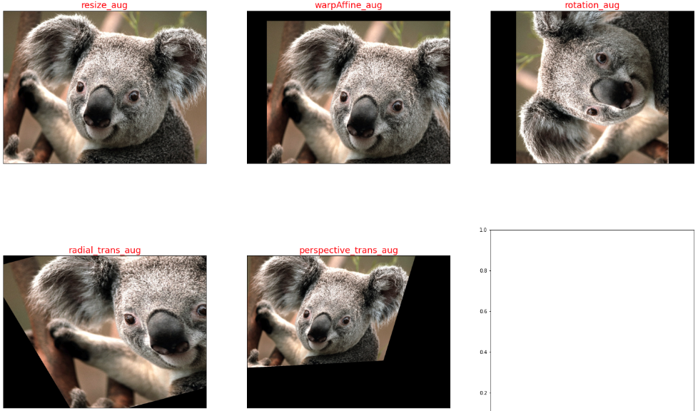
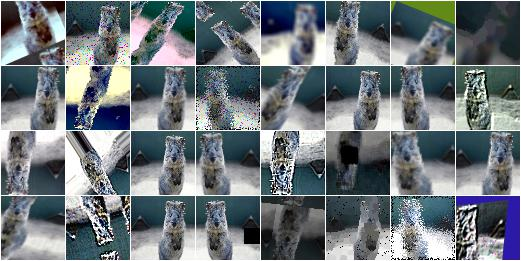

- [一，数据增强概述](#一数据增强概述)
- [二，opencv 图像增强-几何变换](#二opencv-图像增强-几何变换)
- [三，pytorch 图像增强](#三pytorch-图像增强)
- [四，imgaug 图像增强](#四imgaug-图像增强)
- [参考资料](#参考资料)

## 一，数据增强概述

数据增强（也叫数据扩增）的目的是为了扩充数据和提升模型的泛化能力。有效的数据扩充不仅能扩充训练样本数量，还能增加训练样本的多样性，一方面可避免过拟合，另一方面又会带来模型性能的提升。

数据增强几种常用方法有: **图像水平/竖直翻转、随机抠取、尺度变换和旋转**。其中尺度变换（`scaling`）、旋转（`rotating`）等方法用来增加卷积卷积神经网络对物体尺度和方向上的鲁棒性（`Robust`）。

在此基础上，对原图或已变换的图像(或图像块)进行色彩抖动(`color jittering`)也是一种常用的数据扩充手段，即改变图像颜色的四个方面: **亮度、对比度、饱和度和色调**。色彩抖动是在 `RGB` 颜色空间对原有 `RGB` 色彩分布进行轻微的扰动，也可在 `HSV` 颜色空间尝试随机改变图像原有的饱和度和明度(即改变 `S` 和 `V` 通道的值)或对色调进行微调(小范围改变 该通道的值)。

> HSV 表达彩色图像的方式由三个部分组成：
> Hue（色调、色相）
> Saturation（饱和度、色彩纯净度）
> Value（明度）

在机器学习管道（`pipeline`）框架中，我们需要在送入模型之前，进行数据增强，一般有两种处理方式:

- **线下增强**（offline augmentation）: 适用于较小的数据集（smaller dataset）。
- **线上增强**（online augmentation）: 适用于较大的数据集（larger datasets）。

## 二，opencv 图像增强-几何变换

OpenCV 提供的几何变换函数如下所示:

1，**拓展缩放:** 拓展缩放，改变图像的尺寸大小

`cv2.resize()`: 。常用的参数有设定图像尺寸、缩放因子和插值方法。

2，**平移:** 将对象换一个位置。

`cv2.warpAffine()`: 函数第一个参数是原图像，第二个参数是移动矩阵，第三个参数是输出图像大小 (width, height)。举例，如果要沿 $(x，y)$ 方向移动，移动的距离是 $(tx ，ty)$，则以下面的方式构建移动矩阵:
$$
\begin{bmatrix}
1 & 0 & t_x\\ 
0 & 1 & t_y
\end{bmatrix}
$$

3，**旋转:** 对一个图像旋转角度 $\theta$。

先使用 `cv2.getRotationMatrix2D` 函数构建旋转矩阵 $M$，再使用 `cv2.warpAffine()` 函数将对象移动位置。

`getRotationMatrix2D` 函数第一个参数为旋转中心，第二个为旋转角度，第三个为旋转后的缩放因子

4，**放射变换（也叫平面变换/径向变换）:** 在仿射变换中，原图中所有的平行线在结果图像中依旧平行。

为了找到变换矩阵，我们需要从输入图像中得到三个点，以及它们在输出图像中的对应位置。然后使用 cv2. `getAffineTransform` 先构建一个 2x3 变换矩阵，最后该矩阵将传递给 cv2.warpAffine 函数。

5，**透视变换（也叫空间变换）:** 转换之后，直线仍是直线。

> 原理: 透视变换（Perspective Transformation)是指利用透视中心、像点、目标点三点共线的条件，按透视旋转定律使承影面（透视面）绕迹线（透视轴）旋转某一角度，破坏原有的投影光线束，仍能保持承影面上投影几何图形不变的变换。-来源百度百科。

对于透视变换，需要先构建一个 $3\times 3$ **变换矩阵**。要找到此变换矩阵，需要在输入图像上找 4 个点，以及它们在输出图像中的对应位置。在这 4 个点中，其中任意 3 个不共线。然后可以通过函数 `cv2.getPerspectiveTransform` 找到变换矩阵，将 `cv2.warpPerspective` 应用于此 $3\times 3$ 变换矩阵。

图像几何变换的**实例代码**如下:

```python
import cv2
import matplotlib.pyplot as plt
from PIL import Image
import numpy as np

def show_images(imgs, num_rows, num_cols, titles=None, scale=8.5):
    """Plot a list of images.

    Defined in :numref:`sec_utils`"""
    figsize = (num_cols * scale, num_rows * scale)
    _, axes = plt.subplots(num_rows, num_cols, figsize=figsize)
    axes = axes.flatten()
    for i, (ax, img) in enumerate(zip(axes, imgs)):
        try:
            img = np.array(img)
        except:
            pass
        ax.imshow(img)
        ax.axes.get_xaxis().set_visible(False)
        ax.axes.get_yaxis().set_visible(False)
        if titles:
            ax.set_title(titles[i])
    return axes
  
# Some Geometric Transformation of Images
class GeometricTransAug(object):
    def __init__(self, image_path):
        img = Image.open(image_path) # load the image
        self.img_np = np.array(img) # convert PIL image to numpy array
        self.rows, self.cols, self.ch = self.img_np.shape
        self.geometry_trans_aug_visual(self.img_np)
        
    def resize_aug(self, img_np):
        # 直接设置了缩放因子, 缩放原大小的2倍
        res = cv2.resize(img_np, None, fx=2, fy=2, interpolation = cv2.INTER_CUBIC)
        return res
    
    def warpAffine_aug(self, img_np):
        # 先构建转换矩阵, 将图像像素点整体进行(100,50)位移：
        M = np.float32([[1,0,100],[0,1,50]]) 
        res = cv2.warpAffine(img_np, M,(self.cols, self.rows))
        return res
    
    def rotation_aug(self, img_np):
        rows, cols, ch = img_np.shape
        # 先构建转换矩阵,图像相对于中心旋转90度而不进行任何缩放。
        M = cv2.getRotationMatrix2D((self.cols/2, self.rows/2), 90, 1) 
        res = cv2.warpAffine(img_np, M, (self.cols, self.rows))
        return res
    
    def radial_trans_aug(self, img_np):
        # 仿射变换需要从原图像中找到三个点以及他们在输出图像中的位置
        pts1 = np.float32([[50,50],[200,50],[50,200]])
        pts2 = np.float32([[10,100],[200,50],[100,250]])
        # 通过 getAffineTransform 创建一个 2x3 的转换矩阵
        M = cv2.getAffineTransform(pts1,pts2)

        res = cv2.warpAffine(img_np, M, dsize = (self.cols, self.rows))
        return res
    
    def perspective_trans_aug(self, img_np):
        # 透视变换需要一个 3x3 变换矩阵
        pts1 = np.float32([[56,65],[368,52],[28,387],[389,390]])
        pts2 = np.float32([[0,0],[300,0],[0,300],[300,300]])

        M = cv2.getPerspectiveTransform(pts1,pts2)
        # dsize: size of the output image.
        res = cv2.warpPerspective(img_np, M, dsize = (300,300))
        
        return res
    
    def geometry_trans_aug_visual(self, img_np):
        res1 = self.resize_aug(img_np)
        res2 = self.warpAffine_aug(img_np)
        res3 = self.rotation_aug(img_np)
        res4 = self.radial_trans_aug(img_np)
        res5 = self.perspective_trans_aug(img_np)
        imgs = [res1, res2, res3, res4, res5]
        aug_titles = ["resize_aug", "warpAffine_aug", "rotation_aug", "radial_trans_aug", "perspective_trans_aug"]
        # show_images 函数前文已经给出，这里不再复制过来
        axes = show_images(imgs, 2, 3, titles=aug_titles, scale=8.5)
            
if __name__ == '__main__': 
    img_path = 'Koalainputimage.jpeg'
    geometry_trans_aug = GeometricTransAug(img_path)
    img_np2 = geometry_trans_aug.img_np
    print(img_np2.shape)
```

程序运行后输出的**几何变换**增强效果如下所示:



## 三，pytorch 图像增强

在 `pytorch` 框架中，`transforms` 类提供了 `22` 个数据增强方法，对应代码在 transforms.py 文件中，它们既可以对 `PIL Image` 也能对 `torch.*Tensor` 数据类型进行增强。

`api` 的详细介绍可以参考官网文档-[Transforming and augmenting images](https://pytorch.org/vision/stable/transforms.html)。本章只对 transforms 的 `22` 个方法进行简要介绍和总结。

总的来说 transforms.py 中的各个预处理方法可以归纳为**四大类**:

1，**裁剪**-Crop

- 中心裁剪: transforms.CenterCrop 
- 随机裁剪: transforms.RandomCrop 
- 随机长宽比裁剪: transforms.RandomResizedCrop 
- 上下左右中心裁剪: transforms.FiveCrop 
- 上下左右中心裁剪后翻转: transforms.TenCrop

2，**翻转和变换**-Flip and Rotations

- 依概率 p 水平翻转:transforms.RandomHorizontalFlip(p=0.5)
- 依概率 p 垂直翻转:transforms.RandomVerticalFlip(p=0.5) 
- 随机旋转:transforms.RandomRotation

3，**图像变换**

- resize: transforms.Resize
- `min-max Normalization`: 对应 `torchvision.transforms.ToTensor()` 方法
- `zero-mean Normalization`: 对应 `torchvision.transforms.Normalize()` 方法
- 填充: transforms.Pad 
- 修改亮度、对比度和饱和度:transforms.ColorJitter 
- 转灰度图: transforms.Grayscale 
- 线性变换: transforms.LinearTransformation() 
- 仿射变换: transforms.RandomAffine
- 依概率 `p` 转为灰度图: transforms.RandomGrayscale 
- 将数据转换为 `PILImage`: transforms.ToPILImage 
- transforms.Lambda: Apply a user-defined lambda as a transform.

4，对 transforms 操作，使数据增强更灵活

- `transforms.RandomChoice(transforms)`: 从给定的一系列 transforms 中选一个进行操作 
- `transforms.RandomApply(transforms, p=0.5)`: 给一个 transform 加上概率，依概率进行操作
- `transforms.RandomOrder`: 将 transforms 中的操作随机打乱

这里 `resize` 图像增强方法为例，可视化其调整输入图像大小的效果。

```python
# 为了节省空间，这里不再列出导入相应库的代码和show_images函数
img_PIL = Image.open('astronaut.jpeg')
print(img_PIL.size)
# if you change the seed, make sure that the randomly-applied transforms
# properly show that the image can be both transformed and *not* transformed!
torch.manual_seed(0)
# size 参数: desired output size.
resized_imgs = [transforms.Resize(size=size)(orig_img) for size in (30, 50, 100, orig_img.size)]
show_images(resized_imgs, 1, 4)
```

程序运行后的输出图如下。


## 四，imgaug 图像增强

imgaug 是一个用于机器学习实验中图像增强的库。 它支持广泛的增强技术，允许轻松组合这些技术并以随机顺序或在多个 CPU 内核上执行它们，具有简单而强大的随机接口，不仅可以增强图像，还可以增强关键点/地标、边界框、 热图和分割图。

单个输入图像的示例增强如下所示。



imgaug 的图像增强方法如下所示。

- Basics
- Keypoints
- Bounding Boxes
- Heatmaps
- Segmentation Maps and Masks
- Stochastic Parameters: 随机参数
- Blending/Overlaying images: 混合/叠加图像
- Augmenters: 增强器概述

各个方法的使用请参考 [imaug 官网](https://imgaug.readthedocs.io/en/latest/source/installation.html)。

## 参考资料

1. 《解析卷积神经网络-第5、6章》
2. 《OpenCV-Python-Toturial-中文版》