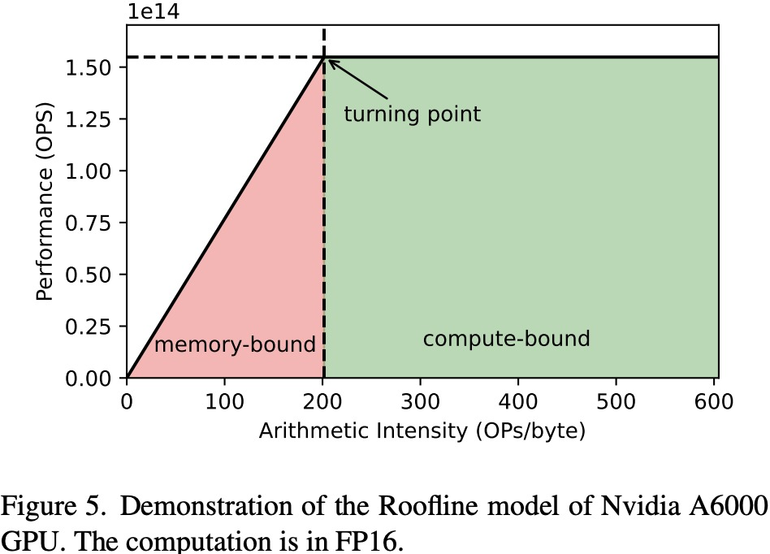
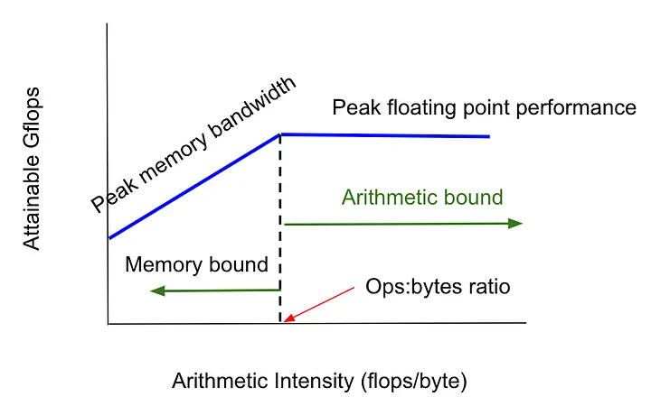
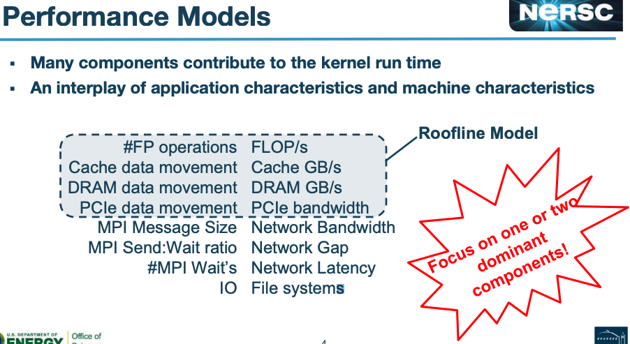
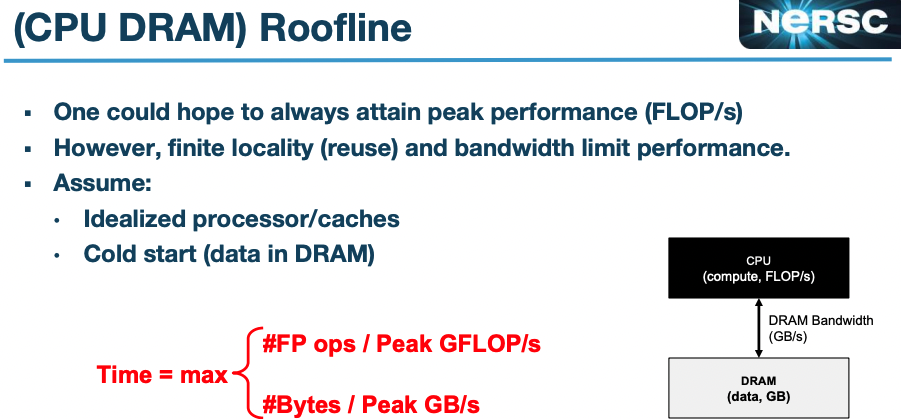

- [一 Roofline 性能分析模型](#一-roofline-性能分析模型)
  - [1.1 Roofline 模型原理](#11-roofline-模型原理)
  - [1.2 Roofline 模型实例分析](#12-roofline-模型实例分析)
  - [1.3 AI 应用性能优化策略](#13-ai-应用性能优化策略)
- [参考资料](#参考资料)

## 一 Roofline 性能分析模型
### 1.1 Roofline 模型原理

`Roofline` 性能分析模型是一种用于**衡量和分析计算性能**的工具，通过将应用程序的计算性能与硬件的理论峰值性能进行对比，**以揭示应用是受到计算性能的限制还是受到内存带宽的限制**。Roofline 模型的有两个关键指标：**操作强度** （Operational Intensity, OI， 也称算术强度 Arithmetic Intensity 和性能上限。

1. 算作强度：每访问一个字节的内存所执行的计算量（FLOPs/Byte）。$\text{OI} = \frac{\text{总浮点操作数（FLOPs）}}{\text{总内存访问量（Bytes）}}$
2. 性能瓶颈分析：
   - 内存受限：当算子的算术强度 <  gpu 的 ops/bytes，性能受内存带宽限制。
   - 计算受限：当算子的算术强度 >  gpu 的 ops/bytes，受限于处理器的计算性能（例如每秒执行的 FLOPs 数量）。

一个 `Naive Roofline` 模型可以表示为如下公式：

$$P_{max} = min(P_{peak}, I*b_{max})$$

$P_{max}$: 性能上限 [操作数/秒]

`CPU/NPU/GPU` 机器相关参数：
- $P_{peak}$: 可用的峰值性能 [操作数/秒]
- $b_{max}$: 可用的峰值带宽 [字节/秒]

代码相关参数：
- $I$: 计算强度 [操作数/字节] $ = \frac{\text{总浮点操作数（FLOPs）}}{\text{总内存访问量（Bytes）}}$ 

`Roofline` 模型可视化曲线如下图所示：



`Roofline` 可以帮助识别程序的性能瓶颈，并指导优化（减少内存访问次数还是算法计算量 `FLOPs`），以及是否达到了硬件的能力上限。

**性能瓶颈**可能来自计算性能（$P_{peak}$）或数据传输路径（$I*b_{max}$）。**通过 roofline 模型判断应用程序是在内存受限还是计算受限，进而进行有针对性的优化**。举个例子，对于矩阵乘法: $A\times B = C$，其中 $A\in \mathbb{R}^{M\times k}, B \in \mathbb{R}^{M\times N},C \in \mathbb{R}^{M\times N}$，数据类型为 `FP16`，它的 Roofline 性能瓶颈分析如下：

$$\text{OI}_\text{matmul} = \frac{2MNK}{MK + KN +MN} \\
\text{ops/bytes}_\text{A100} = \frac{312}{2.03} = 153$$

如果 $\text{OI}_\text{matmul} < 153$，则矩阵乘法处于内存受限，反之则计算受限。

下表是 v100、a100、h100 卡的常用性能指标和 `FP16 Tensor` 算力的操作强度 `oi`:

| GPU  | 显存            | CUDA 核心数 | FP16 Tensor Core 浮点运算能力| FP32 浮点运算能力| 最大内存带宽 | Tensor 运算强度（OI） |
|------|-----------------|------------|--------------------------|--------------------------|--------------|-----------------------|
| V100-SXM | 16 GB           | 5120       | 125 TFLOPS                | 15.7 TFLOPS               | 900 GB/s      | 138 TOPS (FP16)         |
| A100-SXM | 40 GB / 80 GB   | 6912       | 312 TFLOPS                | 19.5 TFLOPS               | 2039 GB/s     | 153 TOPS (FP16)        |
| H100-SXM | 80 GB           | 8192       | 989 TFLOPS(不开启稀疏计算)  | 60 TFLOPS                 | 3350 GB/s     | 295 TOPS (FP16)       |

下表是 llama7b、llama13b、llama70b、gpt3、模型的参数量、计算量和模型推理 prefill 阶段的显存占用量和内存访问代价及操作强度 `oi`:

### 1.2 Roofline 模型实例分析

分析并计算 LLaMA-13B 模型的 Roofline 性能。

**1，计算操作强度（OI）**：

$$\text{OI} = \frac{n\times (24bsh^2 + 4bs^2h) + 2bshV}{1.2*12nh^2 + 4nbh(s+o)} = 7563.29\ \text{FLOPs/Byte}$$

2，**Roofline 模型的理论限制（A100 卡）**：
- **内存带宽**：GPU 的内存带宽为 2039 GB/s。
- **理论计算能力**（FLOPs）：GPU 的理论 `FP16` 计算能力为 312 TFLOPs（$312 * 10^{12}$FLOPs）。

根据这些数据，绘制 Roofline 图可以显示性能的上限，并展示应用程序的瓶颈。

**3，Python 代码示例**:

我们可以用 `Python` 编写一个简单的脚本，计算矩阵乘法的操作强度，并估算性能。

```python
import numpy as np

# 定义 LLaMA-13B 模型的参数
h = 5120    # 隐藏层维度
b = 8       # 推理时的批大小
s = 1024    # 输入序列长度
o = 1024    # 输出序列长度
n = 40      # Transformer 层数
V = 32000   # 词表大小

# 1. 计算每层的 FLOPs, 总 FLOPs = 每层 FLOPs * 层数
total_flops = n * (24*b*s*h*h + 4*b*s*s*h) + 2*b*s*h*V
print(f"Total FLOPs for LLaMA-13B: {total_flops / 10**12:.2f} TFLOPs")


# 2. 总的显存占用量（=显存访问量？）, 2字节访问
total_memory_access = 1.2*12*n*h*h + 4*n*b*h*(s+o)  
print(f"Total memory access: {total_memory_access / 10**9:.2f} GB")

# 3. 计算操作强度（OI = FLOPs / Memory Access）
llama_oi = total_flops / total_memory_access
print(f"Operational Intensity (OI): {llama_oi:.2f} FLOPs/Byte")

# 4. 定义 A100-SXM3 硬件参数
peak_flops = 312 * 10**12  # 312 FP16 Tensor Core TFLOPs
memory_bandwidth = 2039 * 10**9  # 900 GB/s = 900 * 10^9 Bytes/s

# 计算 Roofline 中的两条线

oi_max = peak_flops / memory_bandwidth
# 带宽受限部分（FLOPs = OI * Memory Bandwidth）
bandwidth_bound_performance = oi_values * memory_bandwidth
# 计算受限部分（FLOPs = Peak FLOPs）
compute_bound_performance = np.full_like(oi_values, peak_flops)
```

该代码将输出矩阵乘法的操作强度以及带宽受限时的性能上限。通过比较实际的性能和理论峰值性能，我们可以判断该应用是否是计算受限还是内存受限。

### 1.3 AI 应用性能优化策略







总结：
1. AI 应用的推理时间取决于多个因素，我们应该关注主要因素，比如：内存读写和数学计算时间，而不是次要因素：网络带宽和磁盘读写时间。
2. `Roofline Model` 有两个区域：**内存带宽受限**和**算力受限**区域，分别对应两种不同的优化策略。网络层/模型的算术强度 < GPU 的 `ops:byte ratio`，即内存带宽限制；反之，则是模型算力 FLOPS 限制。
3. AI 模型的推理时间取决于**内存读取时间**和 CPU/GPU **数学（乘加）计算时间**，取决于哪个时间更长。一般来讲，当处于**内存受限**时，内存读取时间长；当处于**算力受限**时，数学计算时间长。

以 A100 GPU 为例，该硬件的 ops:byte ratio 是 $208$（V100 是 $138.9$），这意味着如果我们计算一个 token 的 `kv` 值，与计算多达 `208` 个 token 的时间几乎是相同的！因为低于这个数，会受到内存带宽的限制，且内存时间 > 数学计算时间；高于这个数，我们会受到算力 `FLOPS` 的限制。
> ops:byte ratio 的计算公式，及 数学带宽 vs 内存带宽的理解，请参考文档《英伟达 GPU 性能分析指导》

## 参考资料

- [Roofline: An Insightful Visual Performance Model for Floating-Point Programs and Multicore Architectures*](https://people.eecs.berkeley.edu/~kubitron/cs252/handouts/papers/RooflineVyNoYellow.pdf)
- [LLM Inference Unveiled: Survey and Roofline Model Insights](https://arxiv.org/pdf/2402.16363)
- [Understanding the Roofline Model](https://dando18.github.io/posts/2020/04/02/roofline-model)
- [《Performance Tuning of Scientific Codes with the Roofline Model》](https://crd.lbl.gov/assets/Uploads/SC18-Roofline-1-intro.pdf)
- https://hackernoon.com/understanding-the-roofline-model